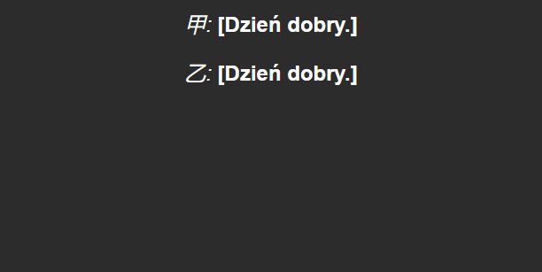
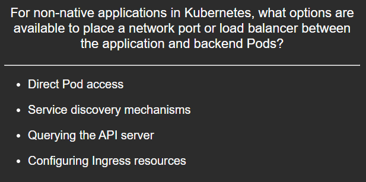
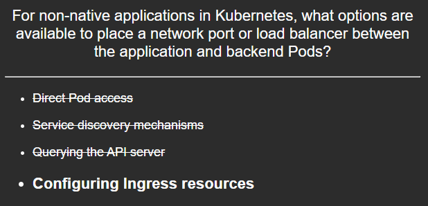

# Project importer for Anki

Anki extension that I use to import my custom project files from [Anki flashcards](https://github.com/dpurge/anki-flashcards).

Install for development:

```cmd
cd %APPDATA%\Anki2\addons21
mklink /D project C:\jdp\src\github.com\dpurge\anki-addon-project\src
```

## Examples

Since project file loads the models (fields, stylesheets, scripts etc.) various kinds of flashcards can be imported from CSV or YAML files.

| Flashcard type  | Question card                               | Answer card                               |
| ---             | ---                                         | ---                                       |
| Question/Answer |          |          |
| Cloze           |    |    |
| Multiple choice |  |  |
